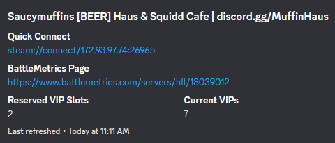
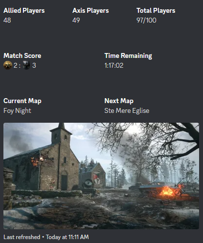
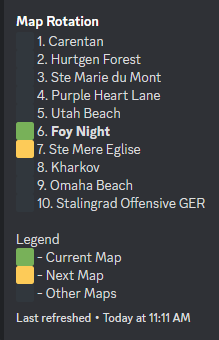

# About

A stand alone Hell Let Loose server status tool for servers running [Community RCON](https://github.com/MarechJ/hll_rcon_tool) with some excellent features!

- Separate and independent sections (server info header, game state [time remaining, etc.] and map rotations)
- User configurable refresh rates per section
- User configurable text for most portions so you can tweak, translate or otherwise localize it for your users.
- Host as many servers as you want and/or have one server update multiple web hooks





# Requirements

- Either `Docker` or Python `3.11`+

You can _probably_ in theory run this anywhere that supports `Docker` or if running it stand alone Python `3.10`+, but I only tested it on `Linux` and with Python `3.11`, anything else is up to you.

# Installing

1. Clone the repository **or** download a release:

```sh
git clone https://github.com/cemathey/hll_server_status.git
cd hll_server_status
```

## Using Docker (recommended)

1. Build the `Docker` `image` which may take a few minutes:

```sh
docker build --tag hll_server_status:latest .
```

2. Create the `Docker` container (can only be done once unless you `docker rm` remove the container):

```sh
docker run -d --init --name hll_server_status -v $(pwd)/logs:/code/logs -v $(pwd)/config:/code/config -v $(pwd)/messages:/code/messages --restart unless-stopped hll_server_status
```

3. After building the image and creating the volume you can simply `docker start`, `docker stop`, or `docker restart` the container as necessary without the `docker run ...` command

## Using Python

1. I'd recommend just running this with `Docker`, otherwise you'll have to make sure you have a compatible version of `Python` and [poetry](https://python-poetry.org/) and you'll just have to figure all that out on your own.

# Configuring

1. You can host as many different servers, or the same server updating different webhooks in the same tool as you want, simply copy the default config (do not delete or otherwise edit the default) use your editor of choice to fill it in. It is a [TOML](https://toml.io/en/) file and most values are set to usable defaults.

```sh
cp default_config.toml config/desired_name.toml
```

## Mandatory Configuration

```toml
[discord]
webhook_url = ""

[api]
# The URL or IP address of your CRCON (ex: http://127.0.0.1:8010/)
# you must include the trailing /
base_server_url = ""
# Your CRCON username and password
username = ""
password = ""
```

# Updating

1. Refresh the git repository **or** download a new release, but see the release notes for any `default_config.toml` changes.

```sh
git pull
docker rm hll_server_status
docker run -d --init --name hll_server_status -v $(pwd)/logs:/code/logs -v $(pwd)/config:/code/config -v $(pwd)/messages:/code/messages --restart unless-stopped hll_server_status
```

# FAQ

1. Any plans to support Battlemetrics RCON?

   No.

2. Something is broken (look at [the Troubleshooting section](#troubleshooting))

   Open a GitHub issue please and include the complete stack trace of your error message if something is truly broken.

3. Any plans to include player statistics/score?

   No, Scorebot which is built into Community RCON already includes this.

4. I can't get this working, will you help me?

   Not beyond this README, it's open source and if you can't figure out how to get it running contact me and I will host it for you for a nominal fee.

5. Any plans to host pre-built Docker images like Community RCON or other projects do?

   No.

6. I don't know how to use Docker, help!

   Start Googling.

# Troubleshooting

- Container name already in use

```sh
docker: Error response from daemon: Conflict. The container name "/hll_server_status" is already in use by container
```

If you _truly_ want to remove the container, but you probably just want to `docker start hll_server_status`:

```sh
docker rm hll_server_status
docker run -d --init --name hll_server_status -v $(pwd)/logs:/code/logs -v $(pwd)/config:/code/config -v $(pwd)/messages:/code/messages --restart unless-stopped hll_server_status
```

# Miscellaneous

If you like what you do and would like me to continue volunteering my time, consider [tossing me a few dollars](https://www.buymeacoffee.com/emathey1)      
